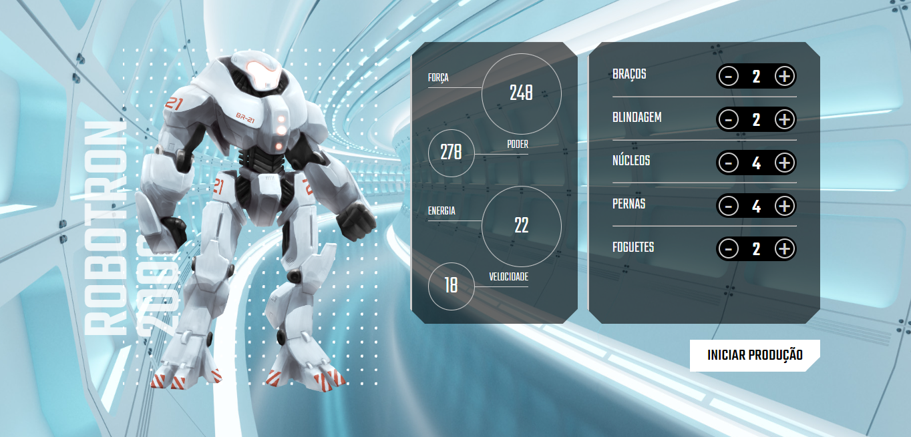

# Robotron-2000

A course proportioned by **Alura** whit the instruction of **Pedro Marins**: ['Click Here to Access'](https://cursos.alura.com.br/course/javascript-manipulando-dom)

# Interface Preview

> ## Course Idea
> 
> The concept is to build the **Robotron 2000**, a war robot created to protect the earth against aliens and there's is some logical defiance to build the robot with their equipments, because all of them has particular stats that can increase or decrease the **Robotron 2000** overall stats.
>
> ### Major Knowledge 
> - Introduce and apply the concepts of DOM Manipulating with `dataset`.

## My Changes 

- ### Code changes 
    - I have changed the Main.js ManipulaDados() functionality to be able to identify the piece altered 
            to display the piece value and to be able to access the object of the piece and change the overall
            stats of robotron.
            
    - I implemented an arrow function to change the color of the robot when the user click's in the image.
        
### 'Desafio' Folders
  
These folders are the course specific challenges that I've done.

### That's it, thanks and enjoy the project
